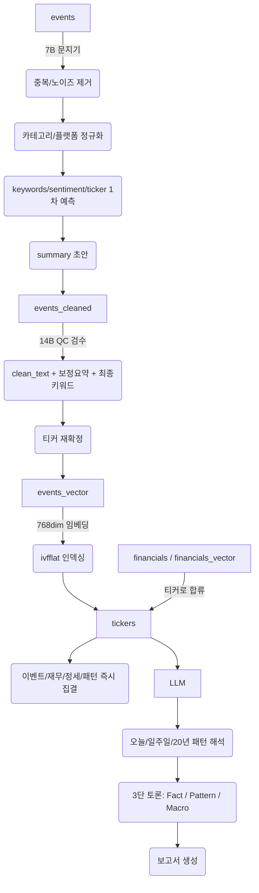

# PROJECT G9 – ANTIGRAVITY SYSTEM SCHEMA (ADMIN ONE-PAGE)

데이터 → 정제 → 벡터 → 티커 → 보고서

모든 흐름을 1페이지로 통제하기 위한 관리자용 핵심도식

---

## 🔵 1. 입력 레이어 (Events Input Layer)

**테이블: events**

뉴스 / 유튜브 / SNS / 리포트 / 내부문서 등 모든 Input의 단일 입구

| 컬럼 | 설명 |
| :--- | :--- |
| id (uuid) | PK |
| title | 제목 |
| summary | 문지기 요약 또는 초기요약 |
| keywords (text[]) | 7B 문지기 키워드 |
| ticker (text) | 매핑된 티커 |
| sentiment | 감성분석 |
| category | 카테고리 |
| platform | youtube / news / sns / etc |
| publisher | 언론사/채널명 |
| country | 국가 |
| url | 원본 링크 |
| published_at | 원본 발행 시각 |
| created_at | 시스템 입력 시각 |
| importance_score | 이벤트 중요도 |
| raw_text | 수집본문 (즉시 폐기 예정용) |

**📌 원칙:**
*   단일 테이블에서 모든 Input 관리
*   raw_text는 보관X → 문지기 후 삭제
*   events는 “세계관의 모든 원자단위” 저장소

---

## 🔵 2. 정제 레이어 (Cleaning Layer)

**테이블: events_cleaned**

문지기(7B) + QC(14B)가 만든 순수 정보 덩어리

| 컬럼 | 설명 |
| :--- | :--- |
| id | PK |
| raw_id | events.id (FK) |
| title | 최종 정규화된 제목 |
| clean_text | 깨끗한 본문 |
| summary | 고정밀 요약 |
| category | 정규화된 카테고리 |
| tickers (text[]) | 복수티커 |
| keywords (text[]) | 보정키워드 |
| sentiment | 정규화 감성 |
| published_at | 그대로 상속 |
| source | 플랫폼판별 |
| country | 국가 |
| created_at | 시간 |

**📌 원칙:**
*   raw_text는 여기서 완전히 대체
*   이 단계를 통과한 데이터만 영구 저장 대상
*   “G9의 데이터 순도”는 여기서 결정됨

---

## 🔵 3. 벡터 레이어 (Semantic Layer)

**테이블: events_vector**

의미공간에서 검색 가능한 ‘압축된 세계 모델’

| 컬럼 | 설명 |
| :--- | :--- |
| id | PK |
| event_id | FK(events_cleaned.id) |
| embedding | vector(768) |
| created_at | 인덱싱 시간 |

**📌 원칙:**
*   embeddings = 최소차원의 초정밀 의미 모델
*   벡터는 events_cleaned 기준으로 생성
*   비용 효율 위해 768dim 확정

---

## 🔵 4. 재무 레이어 (Financial Layer)

**테이블: financials & financials_vector**

**financials**
| ticker | fiscal_date | revenue | eps | roe | roa | debt_ratio | currency | created_at |

**financials_vector**
| financial_id | embedding(768) | created_at |

**📌 원칙:**
*   재무는 독립 레이어
*   티커와 결합해 Gravity Engine에서 합류
*   보고서는 항상 “재무 + 이벤트” 두개를 조립

---

## 🔵 5. 중심 중력장 (Ticker Gravity Layer)

**테이블: tickers**

모든 정보층을 끌어당기는 중력 핵심

| ticker | name | sector | industry | country | created_at |

**📌 역할:**
*   이벤트 20만 / 재무 20년 / SNS 수만 / 유튜브 몇천 → 단일 티커가 순간 호출
*   G9 엔진의 핵심 구조물

---

## 🔵 6. 카테고리 & 퍼블리셔 레이어 (정규화 시스템)

**categories & publishers**
*   events가 무조건 정규화된 카테고리+출처를 갖게 함
*   검색효율, 인덱싱효율 극대화
*   데이터 중복 제거
*   이벤트 조립 시 고급 필터링 기능 제공

---

## 🟣 7. 전체 흐름 (Pipeline 절대 버전)

---

## 🟡 8. 이 문서의 목적

이 한 장만 보면:
*   개발자 onboarding
*   Supabase 스키마 복원
*   전체 엔진 재구축
*   파이프라인 디버깅
*   LLM 보고서 생성 로직 파악
