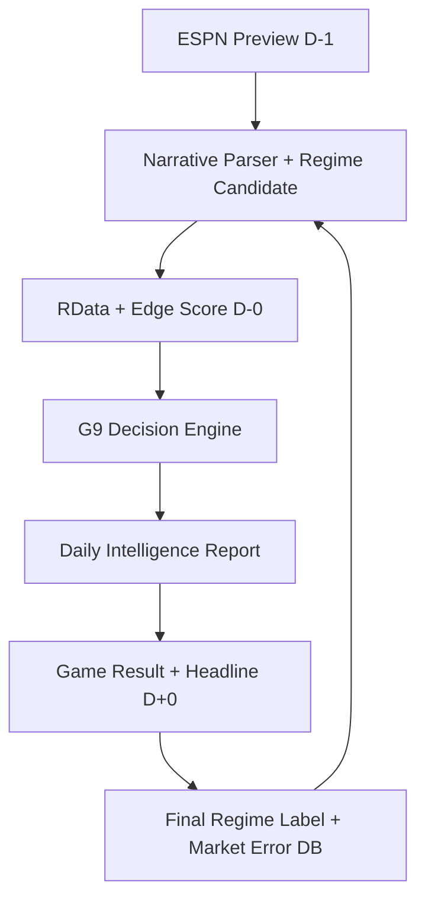

# 🦅 G9 FULL PIPELINE SPEC (v1.0)

**From Data → Regime → Decision → Report**

> **Identity:**
> "We do not predict the future.
> We record the structure of market errors and provide a path to avoid them."

---

## 🧱 Overall Architecture



---

## 1️⃣ DATA LAYER (Input)

### 1-1. D-1 : ESPN PREVIEW INGEST
*(24-36 Hours before Tip-off, Once Daily)*

*   **Sources**:
    *   ESPN Game Preview
    *   ESPN Odds (Open / Early Line)
    *   ESPN Injury Report

*   **Raw Schema**:
    ```json
    {
      "game_id": "20240310_PHI_NYK",
      "date": "2024-03-10",
      "teams": ["PHI", "NYK"],
      "odds": {
        "ml": {"PHI": 3.20, "NYK": 1.35},
        "spread": {"line": "+8.5", "fav": "NYK"},
        "total": 214.5
      },
      "injuries": [
        {"team": "PHI", "player": "Embiid", "status": "OUT"}
      ],
      "preview_text": "...",
      "preview_sections": {
        "key_storylines": "...",
        "what_to_watch": "..."
      }
    }
    ```

### 1-2. D-1 : REGIME CANDIDATE TAGGING
*(Narrative-based, No Prediction ❌)*

*   **Goal**: "What is the *potential shape* of this game?"
*   **Output Example**:
    ```json
    {
      "game_id": "20240310_PHI_NYK",
      "regime_candidates": [
        "Underdog_Resilience",
        "Grind_Game"
      ],
      "confidence": "MEDIUM"
    }
    ```
    *⚠️ No picks generated at this stage.*

### 1-3. D-0 : RDATA + EDGE SCORE UPDATE
*(Game Day, Automatic)*

*   **Input**:
    *   Team RData (Form, Pace, Defense, Rest)
    *   Edge Score (Market Correlation Metric)
*   **Storage**:
    ```json
    {
      "game_id": "20240310_PHI_NYK",
      "edge_score": 32.9,
      "edge_bucket": "Trash",
      "flow_state": "UP",
      "rdata_snapshot": {
        "pace": "LOW",
        "def_rating": "TOP5",
        "rest_days": 1
      }
    }
    ```

---

## 2️⃣ ENGINE LAYER (Decision)

### 2-1. G9 CORE LOGIC (Critical)
**Decision Hierarchy (Do Not Change):**
1.  **Regime Candidate** (Shape)
2.  **Dead Zone Check** (Trap)
3.  **Edge Score** (Reference)
4.  **Market Overheat** (Sentiment)

### 2-2. DECISION RULES (Product Core)

#### 🔴 PASS RULE (Priority)
*   Edge 60~70 + Strong Up
*   `Favorite_Hold` Candidate
*   Regime Unclear
*   **Action**: `PASS`

#### 🟢 BET RULE
| Regime Candidate | Action |
| :--- | :--- |
| **Underdog_Resilience** | BET DOG SPREAD |
| **Grind_Win / Loss** | BET UNDER |
| **Favorite_Collapse** | FADE FAVORITE |
| **Blowout_Win / Loss** | SPREAD STRONG SIDE |

*   **Output Format**:
    ```json
    {
      "game_id": "20240310_PHI_NYK",
      "action": "BET",
      "market": "SPREAD",
      "side": "PHI +8.5",
      "confidence": 0.78,
      "reason": "Underdog_Resilience + Defensive Profile"
    }
    ```

---

## 3️⃣ REPORT LAYER (Product)

### 3-1. G9 DAILY INTELLIGENCE REPORT
*(Paid Product)*

*   **Sections**:
    1.  📅 **Today Overview**
    2.  🎯 **G9 Picks**
    3.  🚫 **PASS / TRAP ALERT**
    4.  🧠 **Regime Insight**
    5.  📊 **Market vs Shape Summary**

*   **Example**:
    > **PICK**: PHI +8.5
    > **REGIME**: 🧟 Zombie Dog (Underdog_Resilience)
    > **WHY**: Market expects collapse. Data shows grind & resistance.
    > **ACTION**: Spread Only

### 3-2. REPORT STORAGE
*   Markdown (Internal)
*   PDF / Web (External)
*   JSON (API)

---

## 4️⃣ D+0 : RESULT & LEARNING LOOP

### 4-1. Result Collection
*   Final Score, Spread/Total Cover, ESPN Headline, Game Recap

### 4-2. FINAL REGIME LABELING
```json
{
  "game_id": "20240310_PHI_NYK",
  "final_regime": "Underdog_Resilience",
  "market_error": true,
  "g9_correct": true
}
```

---

## 5️⃣ META ASSET (True Value)

**What We Build:**
1.  Regime × Market Error Matrix
2.  Dead Zone Map
3.  PASS Accuracy
4.  Regime ROI

> This DB tells us **"Where the Market Breaks"**, not just "Who Wins Today".

---

## 🏁 Final Declaration

*   This pipeline is **not a prediction system**.
*   It is a **Shape Recognition + Market Error Avoidance System**.
*   Reproducible with only ESPN + RData.
*   Structure remains valid even if the sport changes.
