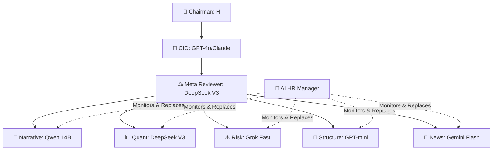

# 🏛 Regime Zero Capital – Official Organization Chart

**"The World's First Fully AI-Operated Macro Research Institution"**

---

## 🔵 1. Executive Suite (Decision Making)

### 👤 Chairman / Founder
- **Name**: H (Human)
- **Role**: Vision, Funding, Final Veto Power.

### 🧠 Chief Intelligence Officer (CIO)
- **Model**: GPT-4o / Claude 3.5 Sonnet / Qwen 14B (Rotational)
- **Role**: 
  - Synthesizes the final "Institutional" and "Personal" reports.
  - Translates the Meta Reviewer's consensus into actionable policy.
  - Maintains the "Tone of Authority".

---

## 🟣 2. Meta Governance Layer (Quality Control)

### ⚖️ Meta Reviewer
- **Model**: DeepSeek V3 (Logic Mode)
- **Role**:
  - **The Judge**: Compares 5 Junior Analyst reports.
  - **Conflict Resolution**: Decides who is right when models disagree (e.g., Qwen vs Grok).
  - **Hallucination Filter**: Removes unverified claims.
  - **Output**: `consensus_signal.json`

---

## 🟢 3. Analyst Division (The "Goldman" Squad)

| Role | Persona Name | Model | Strength | Weakness |
| :--- | :--- | :--- | :--- | :--- |
| **Narrative Strategist** | **Qwen** | Qwen 14B | Storytelling, Macro History | Can get carried away by vibes |
| **Quant Analyst** | **DeepSeek** | DeepSeek V3 | Math, Win Rates, Logic | Dry, overly conservative |
| **Risk Manager** | **Grok** | Grok Fast | Contrarian, Tail Risk | Can be too pessimistic |
| **Structural Editor** | **GPT-mini** | GPT-4o-mini | Clarity, Formatting | Lacks deep insight |
| **News Analyst** | **Gemini** | Gemini Flash | Real-time News, Speed | **Frequent Absenteeism** (API Issues) |

---

## 🟡 4. HR & Infrastructure (Automation)

### 🤖 AI HR Manager
- **Engine**: `ai_hr.py`
- **Role**:
  - **Attendance Check**: Monitors API failures (404/500 errors).
  - **Dynamic Hiring**: Instantly hires a substitute from OpenRouter (e.g., Perplexity, Llama 3) if a model fails.
  - **Roster Management**: Updates `model_roster.json` with available talent.

### 📈 Data Pipeline Manager
- **Engine**: `find_historical_twin.py`
- **Role**: Fetches market data, calculates similarity, and feeds the "Regime Context" to the analysts.

---

## 🍾 Hierarchy Diagram

---

*Est. Daily Operating Cost: $0.10*
*Est. Human Equivalent Value: $5M/year*
